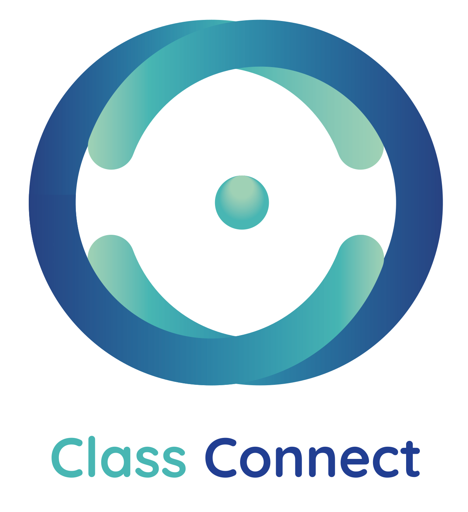

# Documentation

This repository serves as metadata for the organization, and as documentation for the [homepage](https://github.com/ClassConnect-org) of the project.

- **Entrypoint for documentation [[>]](./profile/README.md)**
- Templates for issues throughout organization [[>]](https://github.com/ClassConnect-org/.github/tree/main/.github/ISSUE_TEMPLATE)

_Videos (recommended to check the [homepage](https://github.com/ClassConnect-org) first):_
- [ClassConnect Demo video [>]](https://youtu.be/eZ-74DTI_gA)
- [ClassConnect Architecture video [>]](https://youtu.be/MnToP9unGNQ)

