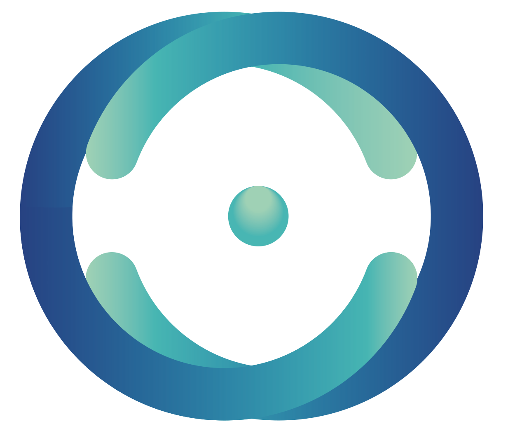

# ClassConnect

ClassConnect es una plataforma de gestión educativa diseñada para facilitar la enseñanza y el aprendizaje en entornos digitales. Su propósito es permitir que docentes y estudiantes interactúen de manera efectiva mediante la creación de clases, asignaciones, exámenes, y recursos educativos en línea. La plataforma evalua integrar un modelo LLM para mejorar la generación de contenido educativo, automatizar correcciones y proporcionar asistencia personalizada a estudiantes y docentes.

## Documentación general

Documentos orientados a dar una visión global del sistema, su estructura, uso y proceso de desarrollo.

| Documento                       | Link |
|----------------------------------|------|
| Arquitectura & Infraestructura            | 
[[>]](./tech/architecture.md)
 |
| Manual de usuario Backoffice     | 
[[>]](./man/backoffice.md)
 |
| Manual de usuario Mobile         | 
[[>]](./man/mobile.md)
 |
| Backlog & Organización           | 
[[>]](./misc/backlog.md)
 |
| Análisis Postmortem              | 
[[>]](./misc/postmortem.md)
 |

## Documentacion tecnica

Referencias para el equipo de desarrollo sobre servicios, infraestructura y aplicaciones implementadas.

### Repositorios IaC

Contiene la configuracion del kong-api-gateway y herramientas de monitoreo.

| Servicio        | Docs                                               | Repo                                 |
|-----------------|----------------------------------------------------|--------------------------------------|
| API Gateway           | 
[[>]](./tech/api_gateway.md)
       | 
[[>]](https://github.com/ClassConnect-org/api-gateway)
 |
| Datadog         | 
[[>]](./tech/datadog.md)
     | 
[[>]](https://github.com/ClassConnect-org/datadog-metrics)
 |

### Micro-servicios (Backend)

Servicios independientes que componen la lógica del negocio.

| Servicio        | Docs                                               | Repo                                 |
|-----------------|----------------------------------------------------|--------------------------------------|
| Users           | 
[[>]](./tech/users.md)
       | 
[[>]](https://github.com/ClassConnect-org/users-microservice)
 |
| Courses         | 
[[>]](./tech/courses.md)
     | 
[[>]](https://github.com/ClassConnect-org/courses-microservice)
 |
| Forum           | 
[[>]](./tech/forum.md)
       | 
[[>]](https://github.com/ClassConnect-org/forum-microservice)
 |
| Notifications   | 
[[>]](./tech/notifs.md)
      | 
[[>]](https://github.com/ClassConnect-org/notifications-microservice)
 |
| AI              | 
[[>]](./tech/ai.md)
          | 
[[>]](https://github.com/ClassConnect-org/ai-microservice)
 |
| Administration  | 
[[>]](./tech/admin.md)
       | 
[[>]](https://github.com/ClassConnect-org/administration-microservice)
 |

### Aplicaciones (Frontend)

Interfaces de usuario de la plataforma.

| Aplicación     | Docs                                               | Repo                                 |
|----------------|----------------------------------------------------|--------------------------------------|
| Backoffice     | 
[[>]](./tech/backoffice.md)
  | 
[[>]](https://github.com/ClassConnect-org/backoffice-app)
 |
| Mobile         | 
[[>]](./tech/mobile.md)
      | 
[[>]](https://github.com/ClassConnect-org/mobile-app)
 |

## Bitacoras

Historial de entregas y avances del proyecto a lo largo del cuatrimestre.

### Checkpoints

| Checkpoint | Link |
|---|------|
| Checkpoint 1 | 
[[>]](./checkpoints/chp1.md)
 |
| Checkpoint 2 | 
[[>]](./checkpoints/chp2.md)
 |
| Checkpoint 3 | 
[[>]](./checkpoints/chp3.md)
 |
| Checkpoint 4 | 
[[>]](./checkpoints/chp4.md)
 |
