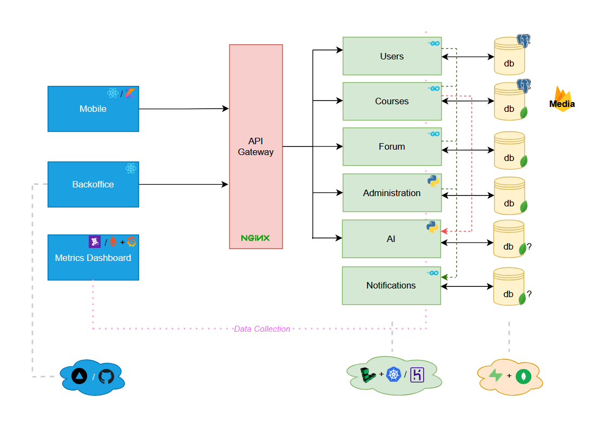

# ClassConnect

ClassConnect es una plataforma de gestión educativa diseñada para facilitar la enseñanza y el aprendizaje en entornos digitales. Su propósito es permitir que docentes y estudiantes interactúen de manera efectiva mediante la creación de clases, asignaciones, exámenes, y recursos educativos en línea. La plataforma evalua integrar un modelo LLM para mejorar la generación de contenido educativo, automatizar correcciones y proporcionar asistencia personalizada a estudiantes y docentes.

## Checkpoint 1

El equipo decidio diseñar la arquitectura del proyecto en base a la arquitectura de microservicios.
Para esto se creo un diagrama en donde se grafican los diferentes componentes del proyecto y como se comunican.

### Componentes

El proyecto fue dividido en una serie de componentes, los cuales son descriptos a continuacion:

**Client Side**
* Mobile App: sera la aplicacion para android con la que van a interactuar los usuarios, esta aplicacion sera desarrollada utilizando [React Native](https://reactnative.dev/) como libreria principal y se comunicara con el *server* a travez de consultas HTTP.
* Backoffice App: funcionara como la aplicacion a ser usada por los administradores de la plataforma con el objetivo de monitorear y editar metadata de la plataforma (reglas, bloqueo de usuarios, registro de auditoria, entre otros). Para su desarrollo se utilizara [React](http://react.dev/) y se desplegara en [GH Pages](https://pages.github.com/) o [Vercel](https://vercel.com/).
* Metrics Dashboard: esta herramienta permitira a los administradores monitorear el desempeño de los servidores, en terminos de aplicacion (metricas de trafico, throughput, etc) y de infraestuctura (metricas de uso de cpu, memoria, etc), para esto se utilizara la plataforma [Datadog](https://www.datadoghq.com/).

**Server Side**
* Users: este microservicio se encargara del manejo del sistema de registro, autenticacion, y administracion de las cuentas de los usuarios.
* Courses: se encaragara de brindar la logica de negocio correspondiente a las funcionalidades de los cursos, las asignaciones o tareas, y la retroalimentacion (alumno-curso, profesor-alumno).
* Forum: su funcion sera administrar los foros pertenecientes a cada curso, brindando un servicio de discusion entre los usuarios dandoles la posibilidad de hacer preguntas y responderlas.
* Administration: este servicio sera utilizado por los administradores de la plataforma para la edicion de reglas y visualizacion del registro de auditoria.
* AI: este sera un servicio que tendra como objetivo recibir "prompts" y devolver una respuesta dada por un modelo de lenguaje generativo. Su implementacion esta sujeta a cambios, pero se planea el uso de un modelo de acceso publico.
* Notifications: sera el encargado de recibir pedidos de notificacion y despacharlas por el medio acorde (ya sea email, sms, o push notifications).
* API Gateway: sera un servicio intermediario entre las peticiones de los usuarios y los microservicios, permitiendo que el *server side* se muestre hacia el exterior como un solo servidor a pesar de estar dividido en distintos servicios.

Algunos de estos servicios utilizaran el lenguaje de programacion [Go](https://go.dev/), junto con la libreria [Gin-Gonic](https://gin-gonic.com/), y otros usaran [Python](https://www.python.org/) junto con [FastApi](https://fastapi.tiangolo.com/). A su vez estos seran desplegados utilizando [Linode](https://www.linode.com/) + [Kuberenetes](https://kubernetes.io/) o alternativamente [Heroku](https://www.heroku.com/).

**Databases**
* Relacionales: Las bases de datos de Users y Courses seran relacionales y utilizaran el motor [Postgres](https://www.postgresql.org/) con el cloud provider [Supabase](https://supabase.com/).
* No Relacionales: Las bases de datos de Forum y Administration, y a su vez potencialmente AI y Notifications utilizaran [MongoDB](https://www.mongodb.com/) en el host [MongoAtlas](https://www.mongodb.com/products/platform/atlas-database).
* Multi-Media: Los archivos multimedia, ya sean imagenes, pdf, entre otros, se almacenaran en [Firebase Storage](https://firebase.google.com/docs/storage).

### Diseño

### Herramienta de Gestion

Como equipo se utilizara [Github Projects](https://docs.github.com/en/issues/planning-and-tracking-with-projects/learning-about-projects/about-projects) para administrar las *issues* o tareas de cada integrante, para cada iteracion del desarrollo. Adicionalmente cada componente de la aplicacion tendra su propio repositorio, pero todos estaran bajo la misma organizacion de github.
