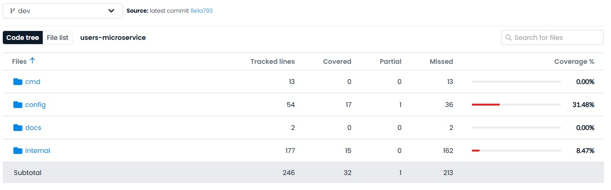
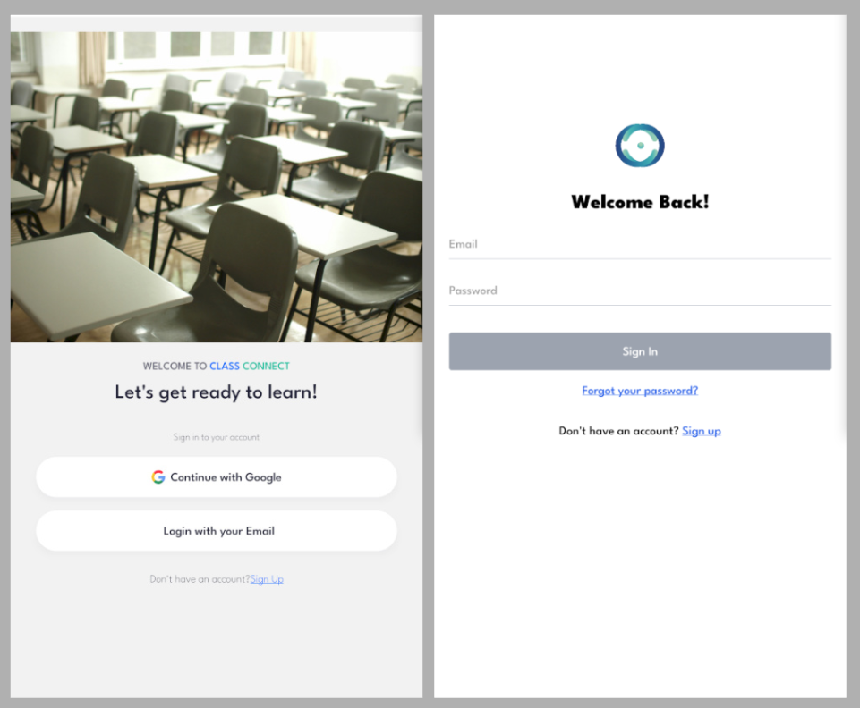
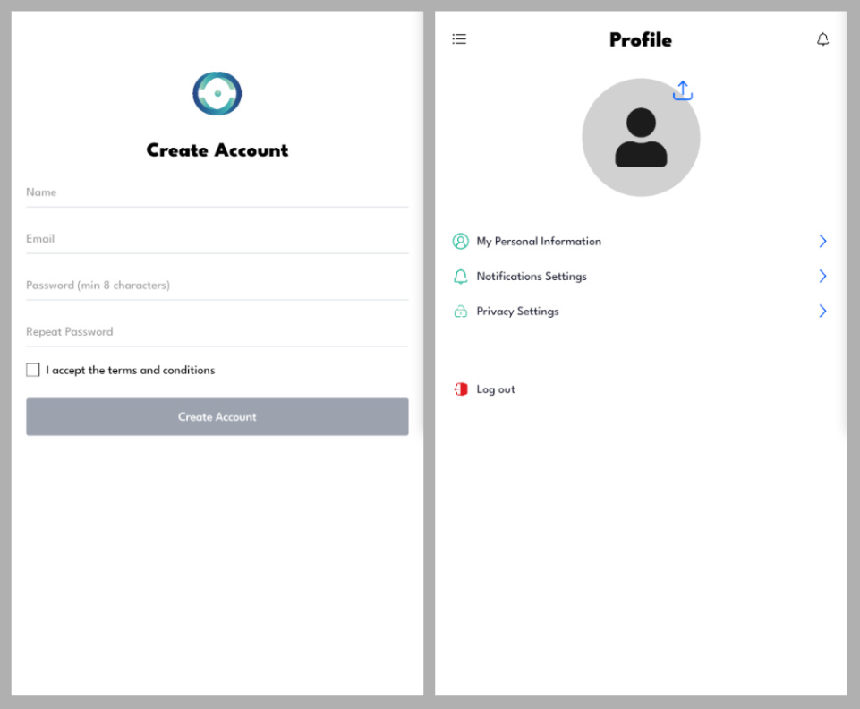
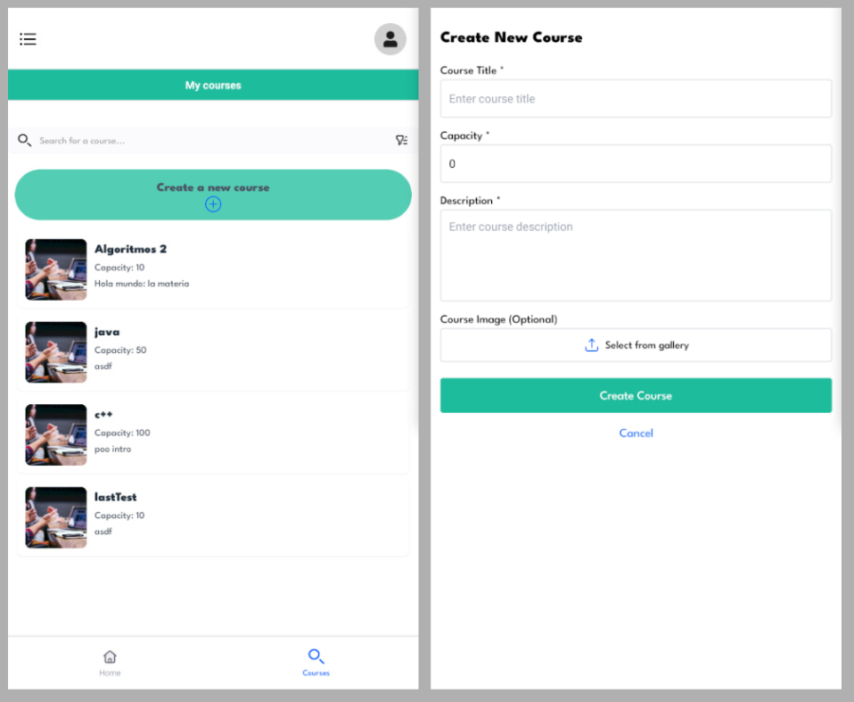

[**Volver**](../README.md)

## Checkpoint 2

Para este checkpoint se tuvo como objetivo incorporar una base para cada uno de los servicios propuestos en el anterior checkpoint, y desplegar los mismos en la nube mediante pipelines de integracion y delivery. A su vez agregarle a cada uno una forma de ver su covertura de tests. Y finalmente integrar algunos endpoints basicos con la aplicacion.

### Cambios respecto al anterior checkpoint

1. Se decidio utilizar [Kong](https://konghq.com/) como Api-Gateway y Load-Balancer en lugar de Nginx ya que esta mejor preparado para este caso de uso, y a su vez es mas simple de extender con plugins personalizadas. Esto ultimo se planea utilizar para verificar *requests* antes de ser entregadas al micro-servicio destino (e.g. tiene que ser administrador para acceder al respectivo servicio).
2. Se cambio el stack del micro-servicio **Notifications** de `Go + Gin-Gonic` a `Python + Fastapi`, por la mayor cantidad de librerias que facilitan y reducen los tiempos de implementacion del servicio.

### Backlog comprometido

El backlog comprometido se puede visualizar [aqui](https://github.com/orgs/ClassConnect-org/projects/1/views/3), este consiste en los siguientes items:

**Users**:

 - View my profile  ✔️
 - View others profiles ✔️
 - Edit Profile ✔️
 - Google Login ✔️

**Courses**:

 - Get Detailed Courses Info ✔️
 - Filter Courses ✔️
 - Validate Data for Courses  ✔️
 - Assignments and Evaluations CRUD ✔️
 - Enroll Student in Course  ✔️
 - Visualize Courses ✔️
 - Configure Eligibility Criteria for Courses ❌
 - Get Courses Containing Students ❌

**Mobile-app**:

 - Create Design from tasks and exams ✔️
 - Receive and Send Courses Information ✔️
 - Add login session system and its persistance ✔️
 - Make views only accesable by ownership on courses  ✔️
 - Create edit profile view ✔️
 - Add working profile view GET request to users service ✔️
 - Make views only accesable by ownership on tasks ❌
 - Design edit and delete course view ❌

**Notifications**:

 - Send Email Notifications for Events  ✔️
 - User Notifications Configuration ✔️
 - Log Notifications  ✔️
 - Send Push Notifications ❌

**DEVOPS**:

 - Metrics with Datadog  ✔️ 

### Cloud

El proveedor de cloud que se decidio utilizar es Linode, en especifico su motor de kubernetes [LKE](https://www.linode.com/products/kubernetes/). Esto permite que los servicios se encuentren en una red privada inaccesible desde el internet, y que solamente puedan ser accedidos a traves del api-gateway mencionado. Para el despliegue de servicios en *pods* de kubernetes, se tomo como herramienta el administrador de paquetes de *k8s* [helm](http://helm.sh), ya que abstrae la configuracion de los recursos por medio de la confeccion de archivos manifiestos en *yaml*.

### CI/CD

Se crearon pipelines para la construccion y despliegue de los servicios (los cuales se ejecutan automaticamente cuando se aceptan cambios a la rama principal), asi como tambien pipelines para asegurar la calidad de los mismos mediante checkeos de codigo y ejecucion de pruebas.

**CI**

- Se construye la nueva imagen de docker del servicio que esta siendo actualizado.
- Se publica la misma en el registro de imagenes de docker de github *GHDR*.

**CD**

- Se configuran los cambios que se hayan hecho en los valores de *HELM*.
- Se descarga la imagen de docker actualizada y se ejecuta en el motor de kubernetes utilizado (LKE).

### Tests & Coverage

Se utiliza [codecov](https://about.codecov.io/) para la visualizacion en dashboard y para las badges de coverage. Al realizar un Pull Request contra las ramas dev (staging branch) y main (production) se ejecutan los tests respectivos del servicio, y se envian los resultados de covertura a codecov.

**Ejemplo de badge**

**Ejemplo de dashboard**

### E2E app-backend

Todos lo servicios discutidos en el checkpoint 1 fueron desplegados en la nube utilizando Kubernetes. Los microservicios de users y courses cuentan con la implementacion basica planeada en el backlog comprometido.

La aplicación desarrollada presenta por el momento un flujo de vistas que permiten la creación e ingreso de cuenta (aún sin manejo de sesión). Una vez el usuario ingresa, se puede crear cursos y visualizar una lista de los ya existentes. También se puede navegar al perfil personal del usuario.

Vista previa del UI de la aplicación:

   
  
  

