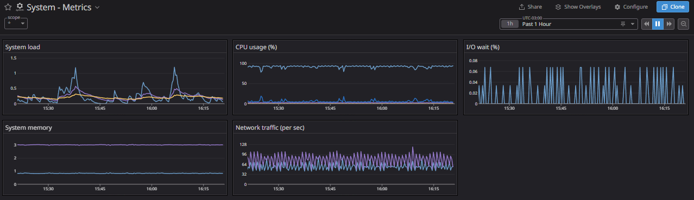
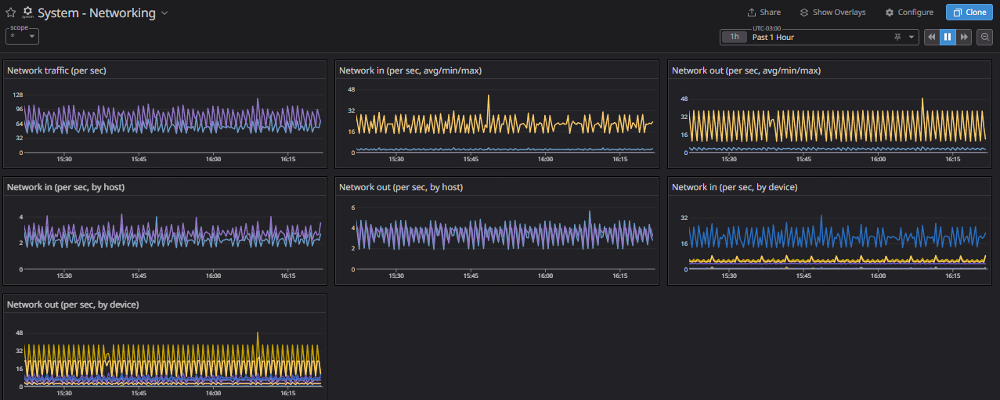
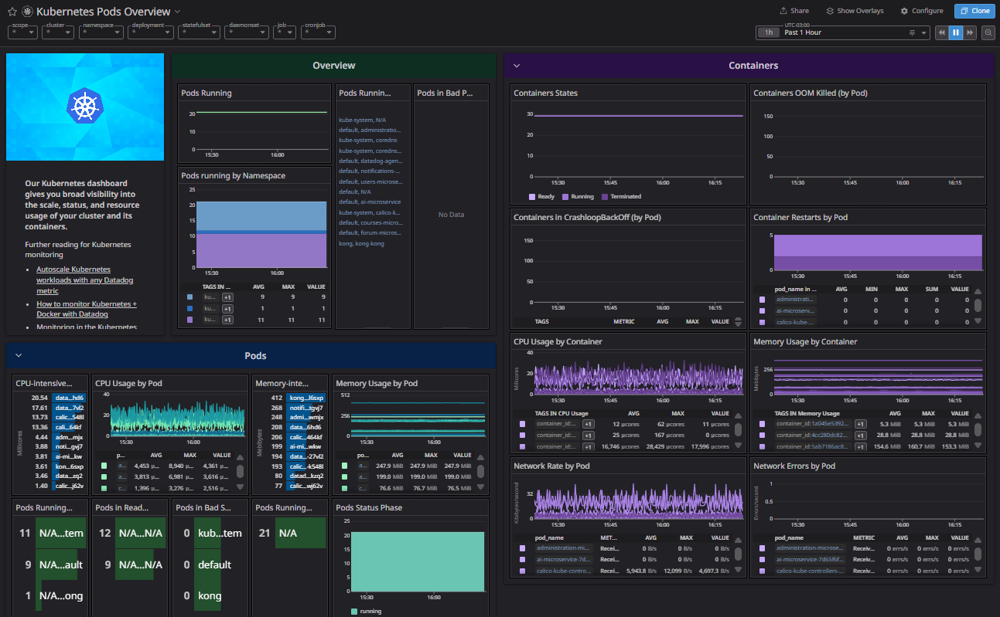
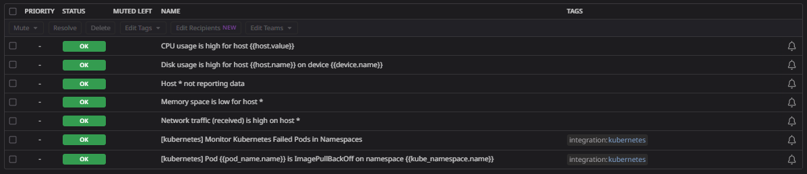

[**Volver**](../README.md)

## Checkpoint 3

Para este checkpoint se ha colocado como objetivo una serie de elementos a desarrollar presentes en el backlog de la iteracion 2 dentro del [github projects](https://github.com/orgs/ClassConnect-org/projects/1/views/2) de la organización, y además incorporar un sistema de analisis de métricas sobre los servicios.

### Cambios respecto al anterior checkpoint

1. Se cambió en el servicio de notificaciones, de smtp con gmail, a la API provista por el sistema de notificaciones [Brevo](https://www.brevo.com/). Esta decision se tomo, dado que el servicio utilizado [*LKE*](https://techdocs.akamai.com/cloud-computing/docs/getting-started-with-lke-linode-kubernetes-engine) para kubernetes, filtra paquetes con protocolo SMTP, ya que como parte de su negocio, ofrecen un servicio pago al respecto.
2. Para el guardado de archivos en la nube, se optó por usar [Supabase Storage](https://supabase.com/docs/guides/storage) en lugar de [Firebase Cloud Storage](https://firebase.google.com/products/storage?hl=es-419), ya que al tener creadas y configuradas dos bases de datos *(users y courses)* en dicha plataforma, se simplifico utilizar la misma para el uso mencionado. Por otro lado, a diferencia de supabase la plataforma firebase, cuenta con una serie de pasos previos para poder usar el servicio (e.g. activar cuenta por medio de verificacion de medio de pago).

#### Sistema de Métricas

Se añadió un sistema de monitoreo a los microservicios utilizando la plataforma [Datadog](https://www.datadoghq.com/), y se ha desplegado un agente de datadog para el clúster de kubernetes que se encuentra montado en la nube, y además un datadog node agent por cada nodo desplegado, como un daemonset.
De esta forma, se obtienen las métricas de todos los servicios en cada nodo, como el funcionamiento y estado de la infraestructura y recursos presentes en el nodo.
Se añandió un nuevo repositorio de infraestructura como código, donde se ejecuta la acción correspondiente para cargar la integración de herramientas de monitoreo de datadog en nuestro clúster.

### Backlog comprometido

El backlog comprometido se puede visualizar [aqui](https://github.com/orgs/ClassConnect-org/projects/1/views/3), este consiste en los siguientes items:

**Users:**

- Google Login ✔️
- View my profile  ✔️
- View others profiles ✔️
- Edit Profile ✔️
- Profile Picture Cloud Storage ✔️
  
**Courses:**

- Get Detailed Courses Info ✔️
- Filter Courses ✔️
- Validate Data for Courses  ✔️
- Assignments and Evaluations CRUD ✔️
- Enroll Student in Course  ✔️
- Visualize Courses ✔️
- Configure Eligibility Criteria for Courses ✔️
- Get Courses Containing Students ✔️
  
**Mobile-app:**

- Create Design from tasks and exams ✔️
- Receive and Send Courses Information ✔️
- Add login session system and its persistance ✔️
- Make views only accesable by ownership on courses  ✔️
- Create edit profile view ✔️
- Add working profile view GET request to users service ✔️
- Make views only accesable by ownership on tasks ❌
- Design edit and delete course view ❌

**Notifications:**

- Send Email Notifications for Events  ✔️
- User Notifications Configuration ✔️
- Log Notifications  ✔️
- Send Push Notifications ❌

**Administration:**

- Rules (CRUD)  ✔️
- Admin Creation & Login ✔️
- Audit Log ❌

**DEVOPS**:
 - Metrics with Datadog  ✔️ 

### Media Cloud Storage

Se utilizó como recurso de almacenamiento de archivos en la nube a [Supabase Storage](https://supabase.com/docs/guides/storage), donde se almacenan hasta el momento las imagenes de perfil de los usuarios.

**Ejemplo de dashboards de datadog**

Entre los dashboards disponibles se encuentran los más relevantes:

System metrics:

System networking: 

Kubernetes pods overview:

También se agrego un sistema de monitoreo con alarmas disparadoras donde al activarse al pasar un umbral pre-definido por ejemplo cierto porcentaje de uso de CPU en alguno de los nodos, se envía una notificación por email a cada uno de los administradores (para esto se creo un google groups, al cual en futuros checkpoints se agregaran automaticamente los nuevos administradores creados):

