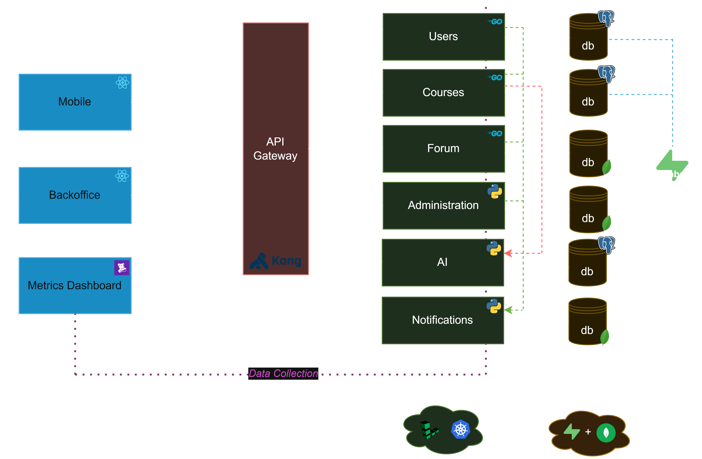

# Arquitectura & Infraestructura

[[<] Go back home](../README.md)

## Arquitectura general del proyecto

Para este proyecto se tomo la decision de confeccionar una aquitectura por microservicios con multiples repositorios, de manera tal que se independizo cada unidad logica diferente en su propio repositorio y su propio servicio.

De esta manera, cada servicio puede tener el *stack* tecnologico que se desee sin comprometer las dependencias de los demas micro-servicios. Ademas se tuvo en cuenta la atomicidad de los mismos y se utilizo la arquitectura interna de *package by layer*, lo que garantizo una mayor facilidad de mantenimiento y de introduccion de nuevas *features*.

El equipo fue capaz de dividir eficientemente la carga de trabajo entre los integrates inicialmente uno por cada micro-servicio y uno para la aplicacion movil, y luego a medida que se terminaron las historias de usuario de cada servicio, hubo cooperacion para la integracion de cada parte, o para *troubleshooting* en algunos casos de error complejos.

Dicho esto, a continuacion se puede ver una representacion grafica de la arquitectura empleada:

## Infraestructura empleada

A nivel de infraestructura, se llevo a cabo una investigacion sobre cada uno de los *cloud-providers* que tienen convenio con el pack estudiantil provisto por github, y sobre los proveedores que no tienen convenio, pero que si tienen un *free-tier*. Los criterios del equipo para la seleccion del proveedor, era principalmente que cuente con un motor de *kubernentes* en el free-tier, esto hizo que la busqueda sea mas complicada ya que no es comun en este tipo de proveedores de *cloud-computing* ofrecer ese tipo de servicios bajo ese tier, por lo que tambien se buscaron proveedores con *hosting* para servicios individuales (lo malo de esto es que cada micro-servicio estaria en un host diferente y no en la misma red interna).

En principio se intento abrir una cuenta con Microsoft-Azure por medio de dicho pack estudiantil, sin embargo se desistio por las dificultades impuestas por la plataforma a la hora de hacerlo. Tambien se tuvo en cuenta otros prooverdores IaaS DigitalOcean, AWS (no cuenta con motor de k8s en free-tier, pero sin embargo fue una opcion considerada), y otros proveedores PaaS como Heroku y Render.

Finalmente se descubrio el proovedor de infraestructura como servicio Linode, y es el que se eligio, debido a que este cuenta con motor de k8s en el free-tier y credito por $100usd, para el que es necesario vincular un medio de pago de credito. Esta plataforma permitio obtener infraestructura con las siguientes caracteristicas:

K8s cluster con:
- 2 Nodos - shared CPU
- Memoria: 4GB ram c/u
- Costo: $33usd/mes
- Validez: 60 dias

La validez de 60 dias significo que, se tuvo que hacer una migracion de todos los servicios deployeados a un nuevo cluster antes de la expiracion del mismo. Este tema se aborda en el [analisis postmortem](../misc/postmortem.md).
