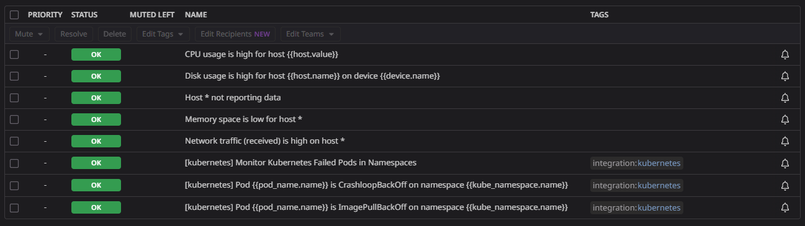
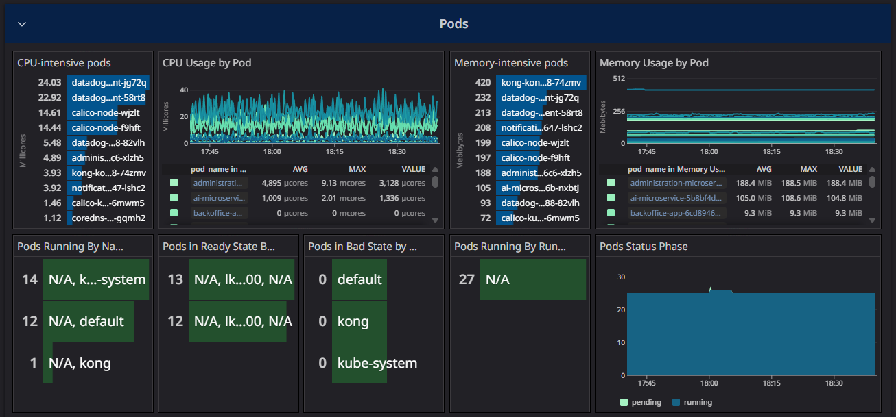
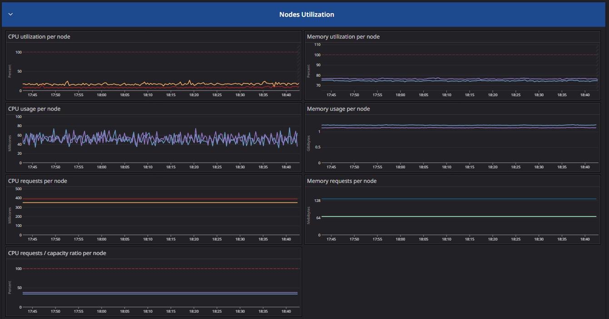
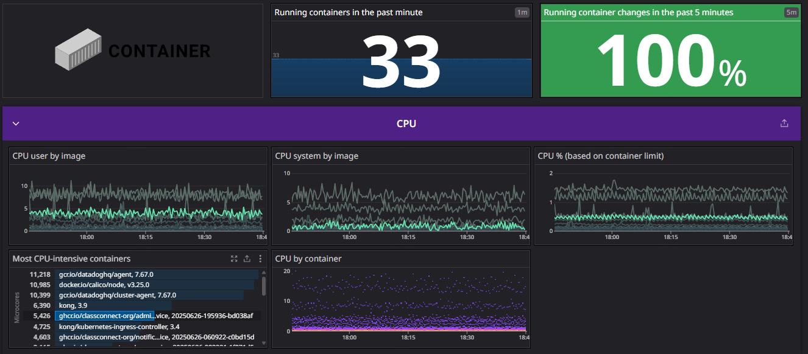
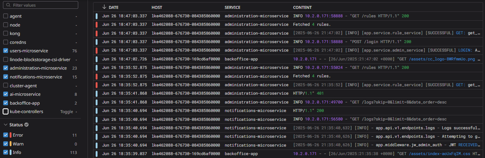

# Monitoreo & metricas con Datadog

[[<] Go back home](../README.md)

Como se menciono en el documento de [arquitectura](./architecture.md), para este proyecto, se tomo la decicion de utlizar las herramientas y plataforma provista por Datadog para el monitoreo de los sistemas y del rendimiento de los servidores. Los servicios de datadog que se discuten a continuacion fueron instalados en el cluster de k8s del proyecto por medio del repositorio de IaC [datadog-metrics](https://github.com/ClassConnect-org/datadog-metrics).

## Datadog Cluster Agent

El **Cluster Agent** de Datadog es un componente centralizado que facilita y optimiza el monitoreo en entornos Kubernetes. No recolecta métricas de sistema directamente, sino que actúa como coordinador y optimizador entre los distintos agentes distribuidos (DaemonSet) y el API server de Kubernetes.

Además, permite configurar alertas desde la plataforma de Datadog para notificar a los administradores sobre eventos relevantes del entorno Kubernetes, como por ejemplo: `"Pods restarting"`, `"ImagePullBackOff"`, entre otros.

## Datadog Agents (DaemonSet)

Los **Datadog Agents** se despliegan en Kubernetes como un **DaemonSet**, lo que significa que se ejecuta una instancia del agente en cada nodo del clúster.

Su función principal es:

- Recolectar métricas a nivel de sistema: uso de CPU, memoria, disco, red, etc.
- Recolectar logs y traces de las aplicaciones que corren en los contenedores.

Este enfoque distribuido asegura que cada nodo esté completamente monitoreado y que se puedan detectar problemas tanto en el host como en los contenedores que alberga.

---

Juntos, el **Cluster Agent** y los **Agents DaemonSet** forman la base del monitoreo en Kubernetes con Datadog, ofreciendo visibilidad completa del entorno.

## Alertas

Se configuraron en la plataforma de datadog una serie de alertas de monitoreo consideradas imprescindibles por el equipo, y se configuro como receptor de dichas alertas un **google group de administradores** creado para este proposito (classconnectgroup@googlegroups.com).

La lista de alertas configuradas contiene:

## Ejemplos de dashboards

K8s pods overview:

K8s nodes overview:

Containers overview:

Logs (filtrables por servicio):

