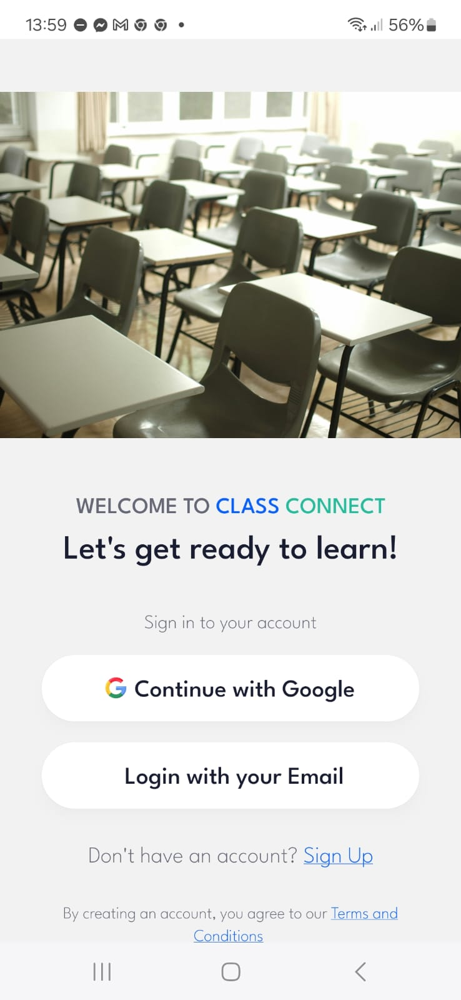
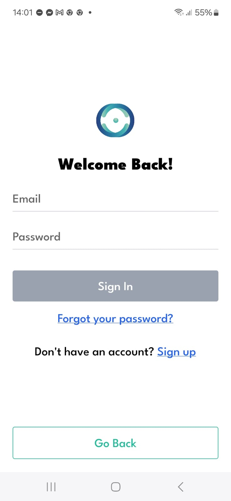
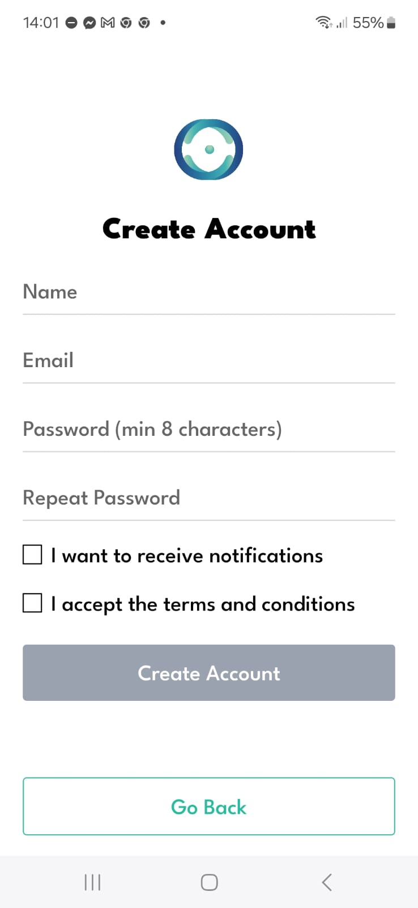
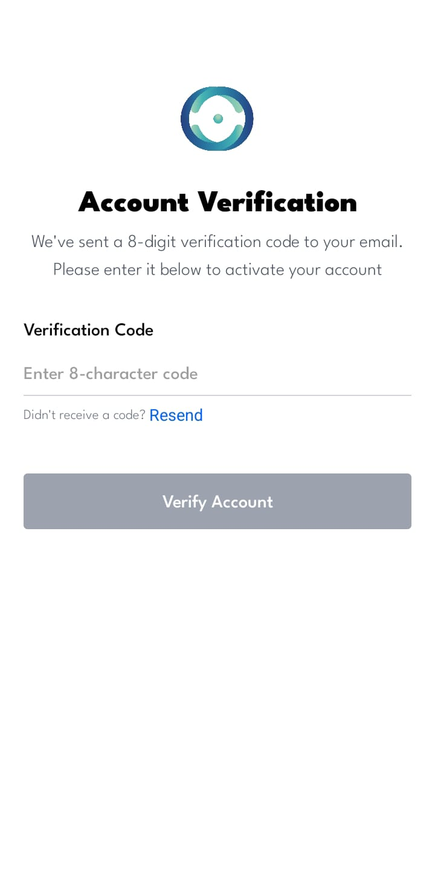
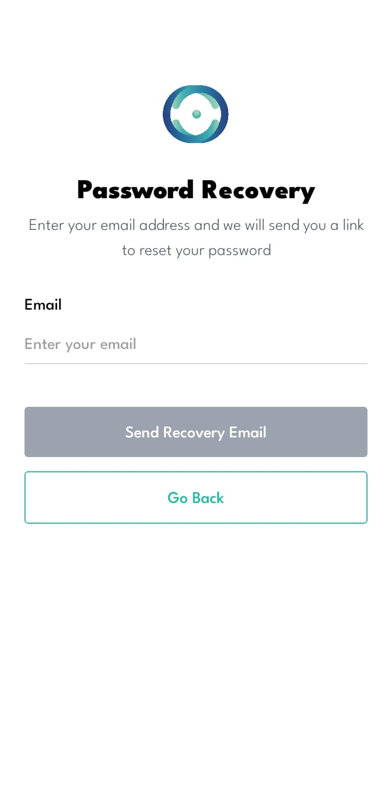

# Mobile Frontend

[[<] Go back home](../README.md)

## Stack

| Layer            | Technology                                      |
|------------------|-------------------------------------------------|
| Language         | [TypeScript](https://www.typescriptlang.org/)  |
| Framework        | [React Native](https://reactnative.dev/)       |
| Runtime & Tooling| [Expo (Development Build mode)](https://expo.dev/)                      |

## Arquitectura del Frontend
Se puede dividir la aplicación en dos partes navegables, en relación al estado de authentificación de la cuenta actual. Por un lado la parte pública, cuando aún el usuario no ha pasado la parte de ingreso de credencial en el registro de la aplicación. Por la otra parte la parte privada de la aplicación donde puede utilizar todas las funcionalidades de la aplicación en sí, una vez que sus credenciales fueron verificadas y el sistema de autentificación al abrir la aplicación si aún continua la sesión mediante el uso de tokens verificadas en el backend JWT, en el caso de un usuario cerrar la aplicación y volver a abrir si aún el token no perdió su validez, será redirigido a la página principal de la aplicación.
Durante la navegación en la parte privada será constantemente chequeadas las credenciales para no tener problemas con las funcionalidades que brindan los microservicios.

### Parte Pública de la aplicación

#### Sistema de ingreso

La forma mas directa de ingresar a la apicación, si se desea usar este método, es mediante el sistema de registro de identidad federada por Google, con el cual podra ingresar eligiendo su cuenta de google registrada en su teléfono, en caso de no tener cuenta previamente, le crea su cuenta automáticamente, tomando los datos básicos de nombre y foto de perfil configurados en su cuenta de google, e email. En caso de tener una cuenta ingresa a la apicación sin ningún otro requerimiento, y en el caso de tener una cuenta previa con esa direccion de email pero sólo utilizó el sistema de ingreso por email y contraseña, podrá combinar ambas cuentas en un mismo ingreso.
El otro modo de ingreso a la aplicación como se mencionó antes brevemente, es con sistema de email y contraseña en caso de tener ya una cuenta creada previamente.

  

  
  

   
Para la creación de cuenta se requieren seguir los pasos que indica la aplicación. Se completan los datos, se requiere aceptar los terminos y condiciones, y si el usuario lo desea se pueden activar o desactivar las notificaciones pop up que recibirá su cuenta activa en la apicación. Una vez completados los datos de la cuenta y aceptados los terminos, se deberá activar la cuenta, mediante un PIN que será enviado por email al usuario que quiera registrar su cuenta.
  

   

  
  

  

   
El usuario también tiene la opción en caso de haber olvidado la contraseña o querer cambiarla, utilizar el sistema de recuperación de contraseña, accediendo a partir de la vista de ingreso por email.
  

   

  

  

   

### Parte Privada de la aplicación

## Librerias Utilizadas

- [Tailwind](https://tailwindcss.com/): framework css para simplificar el diseño.
- [Axios](https://axios-http.com/): cliente HTTP para comunicación con microservicios del backend.

## Comunicacion con otros microservicios

- Users: autentificacion, recuperos, busquedas y visualizacion de perfiles.
- Courses: manejo de cursos, tareas, examenes, modulos, estadisticas, correcciones, etc.
- Forum: creacion de preguntas, votos, respuestas y etiquetas.
- AI: chateo, consultas y criticas constructivas.
- Notifications: obtencion de notificaciones push e historial de las mismas.
